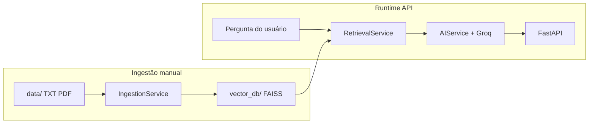

# Chatbot RAG — ClownorCloud

Chatbot com **RAG** (Retrieval-Augmented Generation): documentos em `data/` viram índice vetorial local; cada pergunta recupera trechos relevantes e a IA responde com base nesse contexto.

## Stack

| Componente | Tecnologia |
|------------|------------|
| API | FastAPI + Uvicorn |
| LLM | Groq (`llama-3.3-70b-versatile`) |
| Embeddings | HuggingFace (`sentence-transformers/all-MiniLM-L6-v2`, local/CPU) |
| Banco vetorial | **FAISS** (arquivos em `vector_db/`) |
| Histórico de chat | SQLite (`chatbot.db`) |

## Arquitetura



A ingestão pode ser feita pela **API** (`POST /ingest`) ou por script após colocar arquivos em `data/`.

## Estrutura do projeto

```
chatbot-rag/
├── data/                 # Documentos fonte (.txt, .pdf)
├── vector_db/            # Índice FAISS (gerado pela ingestão; não versionar)
├── src/
│   ├── main.py           # Endpoints FastAPI
│   ├── config.py         # Settings via .env
│   ├── database.py       # SQLite + SQLAlchemy
│   ├── models/           # ChatSession, ChatMessage
│   └── services/
│       ├── ingestion.py      # Pipeline: load → chunk → embed → FAISS
│       ├── retrieval_service.py
│       ├── ai_service.py
│       └── chat_service.py   # Orquestra RAG + histórico + persistência
├── test_ingest.py        # Ingestão + busca semântica de smoke test
├── test_rag_setup.py     # Verifica paths de config
└── requirements.txt
```

## Pré-requisitos

- Python 3.10+
- Chave da API [Groq](https://console.groq.com/)

## Configuração

1. Crie e ative o ambiente virtual:

   ```powershell
   python -m venv venv
   .\venv\Scripts\activate
   ```

2. Instale as dependências:

   ```powershell
   pip install -r requirements.txt
   ```

3. Copie o exemplo de ambiente e preencha a chave:

   ```powershell
   copy .env.example .env
   ```

   Edite `.env` e defina `GROQ_API_KEY`.

## Variáveis de ambiente

| Variável | Padrão | Descrição |
|----------|--------|-----------|
| `GROQ_API_KEY` | — | Obrigatória. Chave da API Groq |
| `DATABASE_URL` | `sqlite:///./chatbot.db` | URL do SQLite |
| `VECTOR_DB_PATH` | `vector_db` | Pasta do índice FAISS |
| `DOCUMENTS_PATH` | `data` | Pasta dos documentos para ingestão |
| `RAG_TOP_K` | `4` | Quantidade de trechos recuperados por pergunta |
| `RAG_SCORE_THRESHOLD` | — | Score máximo aceito no FAISS; menor score = trecho mais parecido |
| `CHAT_HISTORY_LIMIT` | `10` | Mensagens anteriores enviadas ao LLM |
| `DEBUG` | `True` | Flag de debug (settings) |

## Ingestão (obrigatória antes do RAG)

### Via API (recomendado)

Com a API rodando, envie um ou mais arquivos:

```powershell
curl -X POST "http://127.0.0.1:8000/ingest" -F "files=@data/clownorcloud_info.txt"
```

Vários arquivos:

```powershell
curl -X POST "http://127.0.0.1:8000/ingest" -F "files=@documento.pdf" -F "files=@faq.txt"
```

Reindexar tudo que já está em `data/` (sem upload):

```powershell
curl -X POST "http://127.0.0.1:8000/ingest/rebuild"
```

Resposta de sucesso (`201`): `files_saved`, `chunks_created`, etc. Formatos aceitos: **`.pdf`** e **`.txt`** apenas.

### Via script

```powershell
python test_ingest.py
```

Ou:

```powershell
python -m src.services.ingestion
```

Isso cria `vector_db/index.faiss` e `vector_db/index.pkl`. Sem ingestão, o chat funciona, mas **sem contexto** da base de conhecimento.

## Subir a API

```powershell
uvicorn src.main:app --reload
```

Documentação interativa: http://127.0.0.1:8000/docs

### Endpoints principais

| Método | Rota | Descrição |
|--------|------|-----------|
| `GET` | `/` | Status da API |
| `GET` | `/health/rag` | Health check do índice, documentos e embeddings |
| `GET` | `/documents` | Lista documentos `.pdf`/`.txt` em `data/` |
| `DELETE` | `/documents/{filename}` | Remove um documento e reindexa o FAISS |
| `POST` | `/ingest` | Upload de `.pdf`/`.txt` + reindexação FAISS |
| `POST` | `/ingest/rebuild` | Reindexa arquivos já em `data/` |
| `POST` | `/sessions` | Nova sessão de chat |
| `GET` | `/sessions` | Lista sessões |
| `POST` | `/sessions/{id}/messages` | Envia mensagem (RAG + resposta + `sources`) |
| `GET` | `/sessions/{id}/history` | Histórico da sessão |

Exemplo de fluxo:

```powershell
# 1. Criar sessão
curl -X POST http://127.0.0.1:8000/sessions

# 2. Enviar mensagem (substitua {id})
curl -X POST http://127.0.0.1:8000/sessions/1/messages -H "Content-Type: application/json" -d "{\"content\": \"Quais são os planos da ClownorCloud?\"}"
```

### Health check do RAG

```powershell
curl http://127.0.0.1:8000/health/rag
```

Esse endpoint verifica se `data/` existe, quantos `.pdf`/`.txt` estão disponíveis e se `vector_db/index.faiss` + `vector_db/index.pkl` existem. Para testar também o carregamento do modelo de embeddings:

```powershell
curl "http://127.0.0.1:8000/health/rag?check_embeddings=true"
```

Use `check_embeddings=true` com cuidado: na primeira execução ele pode baixar/carregar o modelo do Hugging Face e demorar alguns segundos.

### Gerenciar documentos

Listar documentos disponíveis em `data/`:

```powershell
curl http://127.0.0.1:8000/documents
```

Resposta:

```json
[
  {
    "filename": "clownorcloud_info.txt",
    "extension": ".txt",
    "size_bytes": 1234,
    "modified_at": "2026-05-26T09:30:00"
  }
]
```

Remover um documento e reconstruir o índice:

```powershell
curl -X DELETE "http://127.0.0.1:8000/documents/clownorcloud_info.txt"
```

Se esse for o último documento, o endpoint também remove os arquivos do índice FAISS para evitar respostas com conteúdo antigo.

### Scores e threshold

As respostas de chat retornam `score` em cada fonte recuperada. No FAISS usado aqui, **menor score significa maior similaridade**.

Exemplo:

```json
{
  "sources": [
    {
      "source": "clownorcloud_info.txt",
      "excerpt": "O plano Grande Circo...",
      "score": 0.23
    }
  ]
}
```

Para filtrar trechos fracos, defina `RAG_SCORE_THRESHOLD` no `.env`:

```env
RAG_SCORE_THRESHOLD=0.8
```

Com esse exemplo, só entram no contexto chunks com `score <= 0.8`. Comece sem threshold, observe os scores nas respostas e depois calibre um valor seguro para a sua base.

## Scripts de teste

| Arquivo | O que valida |
|---------|----------------|
| `test_rag_setup.py` | Paths `data/` e `vector_db/` existem |
| `test_ingest.py` | Pipeline completo de ingestão + buscas de exemplo |
| `test_groq.py` | Conexão com a API Groq |
| `test_db.py` | CRUD básico de sessão/mensagem no SQLite |
| `test_ai_core.py` | `ChatService` ponta a ponta (memória + RAG) |

```powershell
python test_rag_setup.py
python test_ingest.py
python test_groq.py
python test_db.py
python test_ai_core.py
```

## Problemas comuns

### `SSL: CERTIFICATE_VERIFY_FAILED` ao fazer `/ingest`

O modelo de embeddings é baixado do Hugging Face na primeira ingestão. No Windows isso costuma falhar por certificado SSL.

**Solução (recomendada):**

```powershell
pip install pip-system-certs certifi
```

Reinicie o uvicorn e tente `/ingest` de novo.

**Alternativa (sem download na API):** baixe o modelo em outra máquina/rede e aponte no `.env`:

```env
EMBEDDING_MODEL_PATH=models/all-MiniLM-L6-v2
EMBEDDING_LOCAL_ONLY=true
```

## Limitações atuais (MVP)

- Reindexação **substitui** o índice inteiro (não há update incremental por arquivo).
- Retrieval apenas por similaridade vetorial (sem rerank ou busca híbrida).
- FAISS em disco: adequado para dev/local; não é um vector DB distribuído.

## Próximos passos sugeridos

1. Update incremental do índice  
2. Rerank ou busca híbrida para melhorar a qualidade do retrieval  
3. Dockerfile e configuração de deploy  
