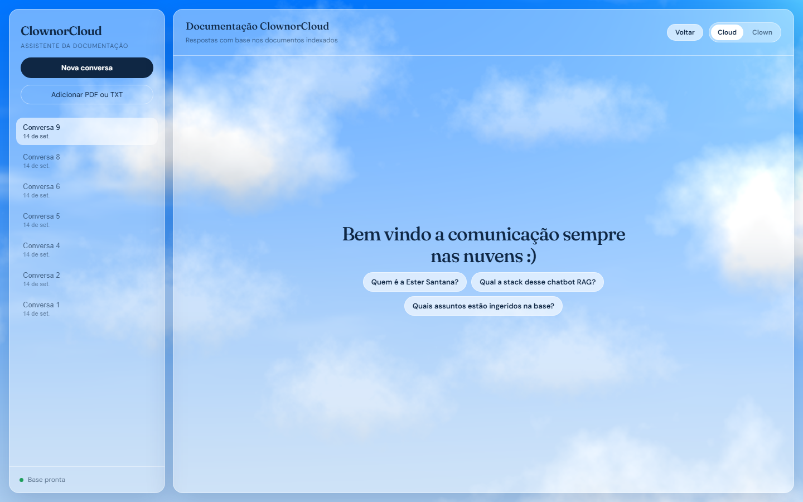
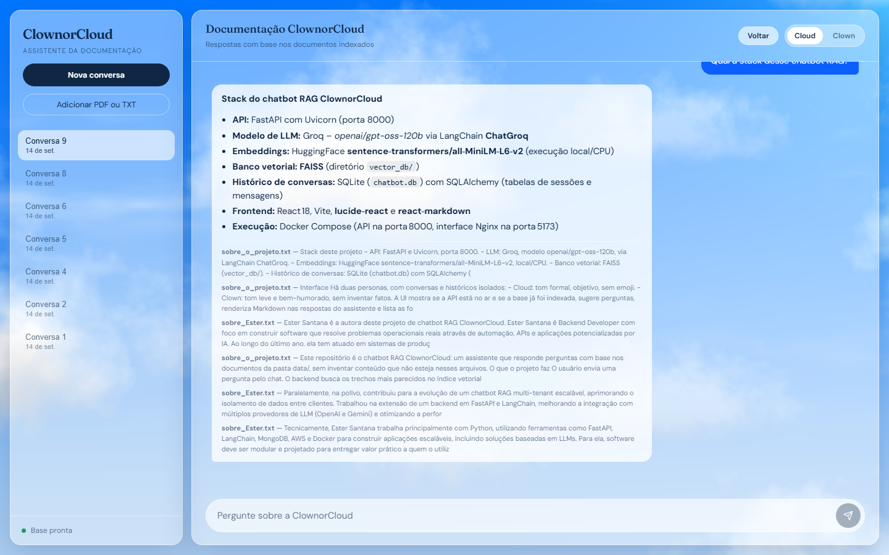
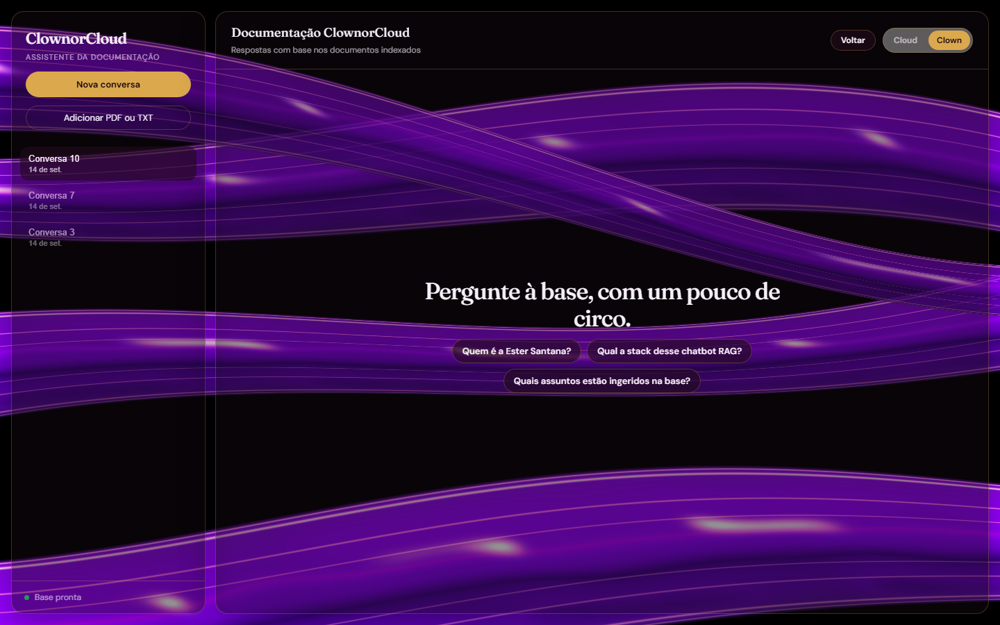
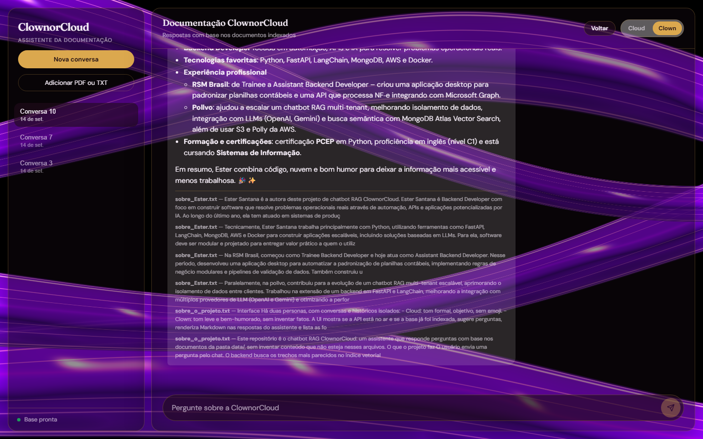
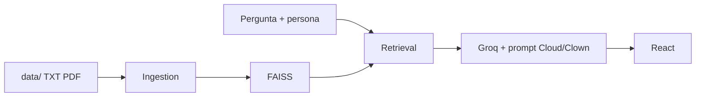

# ClownorCloud — chatbot RAG com duas personas

Um assistente que responde com base nos documentos da pasta `data/`. A mesma pergunta pode ser feita ao **Cloud** ou ao **Clown**: o conteúdo vem da base, o jeito de falar muda.

<p align="center">
  
  
</p>
<p align="center">
  
  
</p>

## Cloud e Clown: a LLM atuando em papéis diferentes

O modelo é o mesmo (Groq). O que muda é o **system prompt**. Cada persona tem conversas isoladas: o histórico do Cloud não vaza para o Clown, e o contrário também não.

As duas compartilham as regras de RAG: responder em português, usar só o contexto recuperado, admitir quando o trecho não está na base, e formatar em Markdown.

### Cloud — assistente educado e treinado

O Cloud entra como um secretário corporativo. Tom formal, objetivo, sem gíria, sem emoji e sem piada. Cumprimenta com cortesia quando faz sentido.

Serve para explicar stack, ingestão, o que está na base ou o currículo da autora com clareza de documentação.

Prompt da persona:

```text
Persona Cloud: secretário corporativo. Seja educado, formal e objetivo,
como quem organiza a agenda de um escritório. Linguagem polida, sem gíria,
sem emoji, sem piada. Cumprimente com cortesia quando fizer sentido.
```

### Clown — o mesmo conhecimento, com humor

O Clown usa o mesmo índice e as mesmas fontes. A instrução é ser leve e brincalhão, com emoji, sempre respeitoso. O humor **não pode inventar fatos** fora do contexto.

Serve para a mesma consulta (quem é a Ester, qual a stack, o que foi ingerido), só que com um tom de circo.

Prompt da persona:

```text
Persona Clown: responda de forma engraçada e leve, sempre respeitosa
(nada de ofensa, deboche pesado ou constrangimento). Use emojis com naturalidade.
O humor não pode inventar fatos fora do contexto.
```

Isso é o uso clássico de LLM como **ator de persona**: um prompt define o papel, o RAG trava os fatos.

## Como o RAG funciona aqui

1. Arquivos `.txt` e `.pdf` em `data/` são fatiados e viram embeddings locais (`all-MiniLM-L6-v2`, CPU).
2. O índice fica no **FAISS** (`vector_db/`).
3. Na pergunta, o backend busca trechos (similaridade + termos da query) e manda esse contexto ao Groq.
4. A resposta na UI traz as **fontes**.

A base atual tem `sobre_o_projeto.txt` (este chatbot) e `sobre_Ester.txt` (autora). Novos arquivos entram pelo botão da sidebar ou por `POST /ingest`.

## Stack

| Camada | Tecnologia |
|--------|------------|
| API | FastAPI + Uvicorn (`:8000`) |
| LLM | Groq `openai/gpt-oss-120b` via LangChain |
| Embeddings | HuggingFace `all-MiniLM-L6-v2` (local/CPU) |
| Vetores | FAISS |
| Histórico | SQLite + SQLAlchemy |
| UI | React 18, Vite, react-markdown |
| Run | Docker Compose (UI Nginx em `:5173`) |



## Subir o projeto

Chave em [console.groq.com](https://console.groq.com/). Copie `.env.example` para `.env` e preencha `GROQ_API_KEY`.

```powershell
docker compose up --build
```

- Interface: http://localhost:5173
- API / Swagger: http://localhost:8000/docs

Na primeira subida a API indexa `data/` se o FAISS ainda não existir (pode baixar o modelo de embeddings). Depois de editar um `.txt`, reconstrua o índice:

```powershell
curl.exe -X POST "http://127.0.0.1:8000/ingest/rebuild"
```

Sem Docker: `pip install -r requirements.txt`, `uvicorn src.main:app --reload`, e no `frontend/` um `npm install && npm run dev`.

## API essencial

| Método | Rota | O que faz |
|--------|------|-----------|
| `GET` | `/health/rag` | Índice, documentos e se a base está pronta |
| `POST` | `/ingest` | Upload de `.txt`/`.pdf` e reindexação |
| `POST` | `/ingest/rebuild` | Reindexa o que já está em `data/` |
| `POST` | `/sessions?persona=cloud\|clown` | Nova conversa daquela persona |
| `POST` | `/sessions/{id}/messages` | Pergunta com RAG (`content` + `persona`) |
| `GET` | `/sessions/{id}/history` | Histórico da sessão |

```powershell
curl.exe -X POST "http://127.0.0.1:8000/sessions?persona=cloud"
curl.exe -X POST "http://127.0.0.1:8000/sessions/1/messages" -H "Content-Type: application/json" -d "{\"content\": \"Qual a stack desse chatbot RAG?\", \"persona\": \"cloud\"}"
```

`GROQ_API_KEY` é obrigatória. O restante tem padrão no `.env.example` (`GROQ_MODEL`, `RAG_TOP_K`, `DOCUMENTS_PATH`, etc.).

## Estrutura

```
data/                 documentos fonte
src/services/         ingestão, retrieval, prompts, orquestração do chat
frontend/             UI Cloud / Clown
vector_db/            índice FAISS (gerado, não versionar)
```

Reindexação substitui o índice inteiro. O FAISS local serve para demo; não é um vector DB distribuído.
